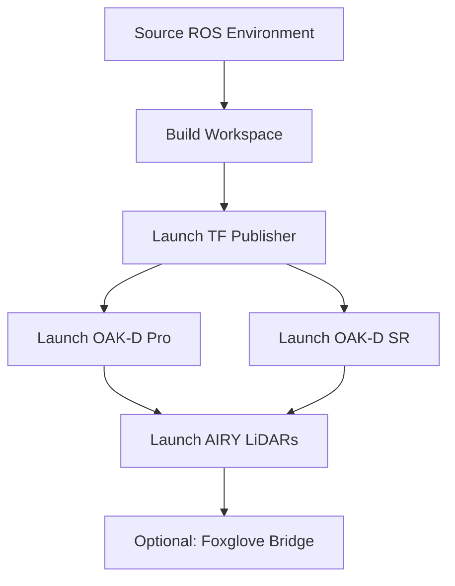

# OAK Multi-Sensor Launch System

## Quick Reference Commands

```bash
# Essential Commands (Easy to Remember)
oak start                   # Launch all sensors
oak map [--lidar front|rear|both]
oak map --lidar-only [--lidar front|rear]   # Map with LiDAR only (no cameras)
oak foxglove                # Launch all sensors + Foxglove bridge
oak stop                    # Stop all processes cleanly

# AIRY LiDAR power control
oak lidar status            # Show LiDAR mode/rpm/laser/temp
oak lidar standby           # Put both AIRY units in Standby
oak lidar run               # Return both AIRY units to Run
oak lidar standby --lidar front|rear   # Target a specific unit

## AIRY LiDAR Power Control

### Default Behavior
- On boot, both AIRY units default to Standby to reduce heat and wear.
- Implemented via a user systemd unit:
  - Unit: `~/.config/systemd/user/airy-standby.service`
  - Script: `src/oak_multi_bringup/scripts/airy_boot_standby.sh`
  - Ensures `OpM=Standby` using the device web API.

### Launcher Integration
- `oak start`/`oak map` sets AIRY to Run before launching `rslidar_sdk`.
- `oak map --lidar-only --lidar rear` starts only the rear LiDAR driver and maps with LiDAR-only nvblox.
- `oak stop` (and cleanup) sets AIRY back to Standby.

### Manual Control
- Status: `oak lidar status`
- Standby/Run: `oak lidar standby` or `oak lidar run`
- Target a unit: add `--lidar front|rear|both` (default `both`).
- Custom IPs (defaults: front `192.168.1.200`, rear `192.168.1.201`):
  - `oak lidar standby --front-ip 192.168.1.210 --rear-ip 192.168.1.211`

### Service Management
- Check status: `systemctl --user status airy-standby.service`
- Logs: `journalctl --user -u airy-standby.service -e -f`
- Disable/Enable: `systemctl --user disable --now airy-standby.service`
- Ensure user services run at boot: `loginctl enable-linger $(whoami)`

### Verify Hardware State
- `oak lidar status` should show `mode=Standby rpm=0 laser=OFF` when idle.
- Spin-up to Run takes a few seconds; verify with a second status call.

# Health monitors (Jetson + OAK temps)
oak start --health          # Sensors + health monitors
oak foxglove --health       # Sensors + Foxglove + health monitors
oak map --health            # Mapping + Foxglove + health monitors

# Alternative Direct Commands
./src/oak_multi_bringup/scripts/launch_all.sh          # Full launch
./src/oak_multi_bringup/scripts/launch_all.sh -f       # With Foxglove
./src/oak_multi_bringup/scripts/launch_all.sh -H       # With health monitors
./src/oak_multi_bringup/scripts/launch_all.sh -c       # Cleanup only
```

## System Overview

This system orchestrates multiple sensors on an autonomous vehicle platform:

### Hardware Components
- **OAK-D-Pro-W**: RGB+Depth camera (front-facing, 15° down)
- **OAK-D-SR**: Depth-only camera (rear-facing, 5° down)  
- **Dual Robosense AIRY LiDARs**: Front and rear 200-series units

### Published Topics
```
# OAK-D Pro (RGB+Depth)
/oak_d_pro/camera/rgb/image_raw          # RGB images
/oak_d_pro/camera/stereo/image_raw       # Depth (16UC1)
/oak_d_pro/points                        # Colorized point cloud
/oak_d_pro/device_temperature            # sensor_msgs/Temperature

# OAK-D SR (Depth-only)
/oak_d_sr/camera/stereo/image_raw        # Depth (16UC1)
/oak_d_sr/points                         # XYZ point cloud
/oak_d_sr/device_temperature             # sensor_msgs/Temperature

# AIRY LiDARs
/airy_200/rslidar_points                 # Front LiDAR cloud
/airy_200/rslidar_imu                    # Front IMU
/airy_201/rslidar_points                 # Rear LiDAR cloud
/airy_201/rslidar_imu                    # Rear IMU

# Diagnostics (temperatures & health)
/diagnostics                              # diagnostic_msgs/DiagnosticArray
  - jetson/*                              # Jetson CPU/GPU/SOC temps
  - airy_front/temperature                # Front AIRY temp (C)
  - airy_rear/temperature                 # Rear AIRY temp (C, if present)
```

### TF Tree Structure
```
base_link (vehicle center)
├── camera_rgb_camera_optical_frame      # OAK-D Pro
├── camera_right_camera_optical_frame    # OAK-D SR
├── airy_front                           # Front LiDAR
└── airy_rear                            # Rear LiDAR
```

---

## Technical Implementation Details

### Architecture Philosophy

The system uses a **staged launch approach** for maximum stability:

1. **TF Foundation**: Static transforms published first via `robot_state_publisher`
2. **Isolated Camera Containers**: Each OAK camera runs in separate containers to prevent mutual interference
3. **Independent LiDAR Process**: AIRY sensors run via separate `rslidar_sdk` launch
4. **Optional Visualization**: Foxglove bridge with optimized QoS settings

### Launch Sequence & Dependencies



**Critical Timing**:
- 3-second delays between launches allow proper initialization
- TF must be established before cameras start
- Camera containers need isolation to prevent X_LINK_DEVICE_ALREADY_IN_USE errors

### Process Management

#### Launch Processes
```bash
# Background processes with PID tracking
TF_PID=$(ros2 launch oak_multi_bringup robot_state.launch.py &)
PRO_PID=$(ros2 launch oak_multi_bringup oak_pro.launch.py &)
SR_PID=$(ros2 launch oak_multi_bringup oak_sr.launch.py &)
LIDAR_PID=$(ros2 launch rslidar_sdk dual_airy_start.py &)
FOXGLOVE_PID=$(ros2 launch oak_multi_bringup foxglove_bridge.launch.py &)
```

#### Cleanup Strategy
```bash
# Graceful termination via stored PIDs
kill $FOXGLOVE_PID $LIDAR_PID $SR_PID $PRO_PID $TF_PID

# Aggressive cleanup for stubborn processes
pkill -f 'rslidar_sdk_node'
killall -9 rslidar_sdk_node
```

### Hardware Configuration

#### OAK Camera Settings

**OAK-D Pro Configuration** (`config/oak_pro_only.yaml`):
```yaml
camera:
  i_pipeline_type: RGBD
  i_mx_id: "YOUR_PRO_MXID"
  i_publish_tf_from_calibration: false  # URDF owns TF

stereo:
  i_align_depth: true
  i_lr_check: true
  i_subpixel: true
  i_output_disparity: false

rgb:
  i_fps: 30.0
```

**OAK-D SR Configuration** (`config/oak_sr_only.yaml`):
```yaml
camera:
  i_pipeline_type: Depth
  i_mx_id: "YOUR_SR_MXID"
  i_publish_tf_from_calibration: false

stereo:
  i_resolution: 400P
  i_fps: 20.0
  i_align_depth: false
  i_publish_synced_rect_pair: false
```

#### Physical Mounting (TF Coordinates)

**Coordinate System**: ROS standard (x=forward, y=left, z=up) relative to `base_link`

```yaml
# OAK-D Pro: Front-facing, 15° down
camera_rgb_camera_optical_frame:
  translation: [0.148469, 0.0, 0.097926]
  rotation: [-1.8325957, 0.0, -1.5707963]  # RPY radians

# OAK-D SR: Rear-facing, 5° down  
camera_right_camera_optical_frame:
  translation: [-0.211326, 0.0, 0.023959]
  rotation: [-1.6580628, 0.0, 1.5707963]

# AIRY Front: Forward-facing LiDAR
airy_front:
  translation: [0.110367, 0.0, 0.037388]
  rotation: [1.5707963, 0.0, 1.5707963]

# AIRY Rear: Rear-facing LiDAR
airy_rear:
  translation: [-0.203071, 0.0, 0.061300]
  rotation: [0.0, 0.0, 1.5707963]
```

### QoS Configuration

#### Point Cloud Streaming
- **Publisher QoS**: `SENSOR_DATA` (best_effort, volatile, depth=1)
- **Subscriber QoS**: `BEST_EFFORT` for real-time performance
- **Rationale**: Prioritizes low latency over reliability for visualization

#### TF Broadcasting
- **Static TF**: `RELIABLE + TRANSIENT_LOCAL` ensures tf_static persistence
- **Dynamic TF**: `RELIABLE` for accurate transformation chains

### Network Considerations

#### Multi-Robot Environments
```bash
export ROS_DOMAIN_ID=42  # Set unique domain to avoid cross-talk
```

#### Foxglove Connection
- **WebSocket**: `ws://<robot-ip>:8765` (prefer IPv4 literal over hostname)
- **Fixed Frame**: `base_link`
- **QoS Overrides**: Configured in `config/foxglove_qos.yaml`

If connecting via mDNS (e.g., `ubuntu.local`) fails, resolve the IPv4 and use it directly:
```bash
# On Mac
dns-sd -G v4 ubuntu.local
# In Foxglove: ws://<resolved-ip>:8765
```

#### Access Point (AP) Mode (Field/Restricted Networks)
- Jetson switches to AP automatically if no known WiFi (60s timeout).
- SSID: `alpha_orin_wireless`, Password: `9909`, Jetson IP: `192.168.4.1`
- SSH: `ssh alpha_orin@192.168.4.1`
- Foxglove URL (AP): `ws://192.168.4.1:8765`

### Troubleshooting & Recovery

#### Common Issues

**X_LINK_DEVICE_ALREADY_IN_USE**:
```bash
oak stop                    # Clean shutdown
# Wait 3-5 seconds
# Power-cycle OAK cameras
oak                         # Restart
```

**LiDAR Topics Persist After Shutdown**:
- Normal ROS2 behavior - topics disappear after ~5 seconds
- Processes are properly terminated even if topics temporarily persist

**Foxglove Cloud Display Issues**:
```bash
# Verify QoS settings
ros2 param get /foxglove_bridge "qos_overrides./oak_d_pro/points.subscription.reliability"
# Should return: best_effort
```

**Foxglove Cannot Connect**:
- Ensure the bridge is running and listening:
  ```bash
  ps aux | grep -i foxglove_bridge | grep -v grep
  ss -lntp | grep 8765
  ```
- Use IPv4 explicitly in Foxglove (e.g., `ws://192.168.1.174:8765` or AP `192.168.4.1`).
- Some facility WiFi configurations block WS ports or isolate clients — use AP mode when in doubt.

---

## Health Monitoring

This system publishes device temperatures and health via standard ROS 2 diagnostics and dedicated temperature topics.

### What’s Published
- `/diagnostics` (diagnostic_msgs/DiagnosticArray)
  - `jetson/CPU`, `jetson/GPU`, `jetson/SOC`, etc. with `temperature_celsius`
  - `airy_front/temperature`, `airy_rear/temperature` with `temperature_celsius`
- `sensor_msgs/Temperature`
  - `/oak_d_pro/device_temperature`
  - `/oak_d_sr/device_temperature`

### Enable Health Monitors
```bash
oak start --health              # or: oak foxglove --health, oak map --health
```
This runs:
- `sensor_health_monitor` (Jetson thermals → `/diagnostics`)
- `oak_temp_bridge` (bridges DepthAI diagnostics → `/oak_*/device_temperature`)
- `rslidar_sdk` diagnostics publisher (AIRY temps → `/diagnostics`)

### Verify (SSH)
```bash
source ~/ros2_ws/install/setup.bash

# OAK temps
ros2 topic echo /oak_d_pro/device_temperature
ros2 topic echo /oak_d_sr/device_temperature

# Diagnostics snapshot (Jetson + AIRY)
ros2 topic echo --once /diagnostics | grep -E "hardware_id|name: .*temperature|temperature_celsius"
```

### Foxglove Panels
- Add Time Series for `/oak_d_pro/device_temperature`, `/oak_d_sr/device_temperature`.
- Or subscribe to `/diagnostics` and filter `temperature_celsius`.

## Nvblox Mapping (Isaac ROS)

Nvblox integrates depth into a GPU-accelerated TSDF/ESDF map.

### Start
- Source env: `source ~/ros2_ws/install/setup.bash`
- One-liner (recommended): `oak map` — launches both OAK cameras (Pro + SR), nvblox (front AIRY LiDAR), and Foxglove.
  - Options: `oak map --lidar rear` to use the rear AIRY LiDAR.
- Manual (advanced):
  - `ros2 launch oak_nvblox_bringup nvblox_dual_cams_with_lidar.launch.py`
  - Defaults: dual cameras, front LiDAR, `global_frame=base_link`, QoS `SENSOR_DATA`, ESDF 3D.
  - Note: color is disabled to avoid BGR8 vs RGB8 mismatch; can be enabled later with RGB8 conversion.

### One-liner
- `oak map` — launches sensors, nvblox (dual cameras + front AIRY LiDAR by default), and Foxglove bridge.
- Options:
  - `oak map --lidar rear` — use rear AIRY LiDAR only
  - `oak map --lidar both` — experimental; nvblox may reject multi‑LiDAR; launcher will fallback to front.

### Visualize (Foxglove)
- Connect: `ws://<robot-ip>:8765`
- Fixed frame: `base_link`
- Topics of interest:
  - `/nvblox_node/static_esdf_pointcloud` (PointCloud2, 3D ESDF points)
  - `/nvblox_node/static_map_slice` (2D ESDF slice)
  - `/nvblox_node/static_occupancy_grid`, `/nvblox_node/combined_occupancy_grid` (OccupancyGrid)
  - `/nvblox_node/mesh` (triangular mesh)
  - Optional visualization markers: `/nvblox_node/esdf_slice_bounds`, `/nvblox_node/workspace_bounds`

### Stop
- Ctrl+C the nvblox launch terminal (if started separately)
- `oak stop` to stop sensors, Foxglove, and nvblox (from `oak map`)

### Troubleshooting
- If nvblox topics don’t appear (especially with dual LiDAR), launcher falls back to front LiDAR.
- Inspect logs: `tail -n 200 ~/ros2_ws/log_nvblox_map.txt`.

### Next Steps
- Enable color mapping once RGB8 conversion is added.
- Investigate robust dual‑LiDAR support (multi‑sensor inputs or pre‑fusion).
- Add map save/load helpers and an `odom`/`map` frame option.

### Notes
- Mapping frame is `base_link` (no `odom` yet). Update to `odom`/`map` when available.
- OAK‑D SR and AIRY LiDARs are independent and can run alongside mapping.

### File Structure
```
ros2_ws/
├── src/oak_multi_bringup/
│   ├── scripts/
│   │   ├── oak                    # Simple command interface
│   │   ├── launch_all.sh         # Main orchestration script
│   │   └── setup_oak_command.sh  # PATH setup
│   ├── config/
│   │   ├── oak_pro_only.yaml     # OAK-D Pro parameters
│   │   ├── oak_sr_only.yaml      # OAK-D SR parameters
│   │   └── foxglove_qos.yaml     # Bridge QoS settings
│   ├── launch/
│   │   ├── robot_state.launch.py  # TF publisher
│   │   ├── oak_pro.launch.py      # Pro camera
│   │   ├── oak_sr.launch.py       # SR camera
│   │   └── foxglove_bridge.launch.py
│   └── urdf/
│       └── oak_sensors.urdf.xacro # Static TF definitions
└── OAK_MULTI_SENSOR_LAUNCH.md    # This documentation
```

### Integration Points

#### External Dependencies
- `rslidar_sdk`: For AIRY LiDAR drivers
- `foxglove_bridge`: For web-based visualization
- `robot_state_publisher`: For URDF-based TF broadcasting

#### Extension Points
- Add new sensors by extending URDF and launch files
- Modify QoS settings in respective config files
- Integrate with navigation stack via standard sensor topics
